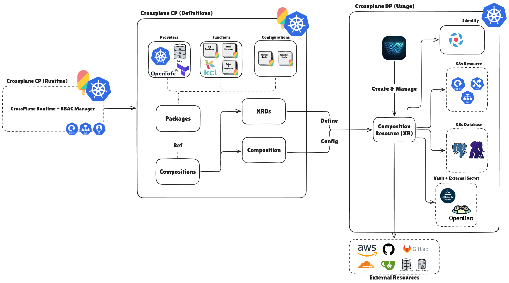

# W'xOps Core

***"Ask Kubernetes for a GitHub repository, a PostgreSQL database, or a full application deployment — get a real one back."***

> [!NOTE]
> W'xOps Core is a library of [Crossplane v2](https://docs.crossplane.io/v2.3/) Configuration packages: each one defines a schema (an `XRD`) and the logic that
> turns it into real infrastructure (a `Composition`), so `kubectl apply -f my-app.yaml` provisions a repository on Gitea or GitHub, a CloudNativePG database, or a
> Deployment/Service/IngressRoute stack — no custom controller, no platform UI required to use it.

## The problem this solves

Standing up a new tenant app or database today usually means: click through Gitea's UI to create a repo, hand-write Terraform for the database, copy-paste a
Deployment Service/Ingress from the last app that looked similar, and wire the secrets together by hand. Every step is a manual, undocumented, tribal-knowledge
operation.

W'xOps Core turns each of those into a Kubernetes object with a schema: `XScmRepository`, `XTenantDatabase`, `XTenantApp`, and three more. Crossplane reconciles
them the same way it reconciles anything else — continuously, declaratively, with `status` fields you can poll instead of watching an apply scroll by. What
actually executes underneath (HCL run in-cluster against a Gitea or GitHub provider, or Kubernetes objects composed via KCL) is an implementation detail the schema hides.

This repo is **only the Configuration packages** — the schemas and the composition logic. It has no UI, no CLI, and no build pipeline; **see [Out of
scope](development-docs/_archives/ROADMAP.md#out-of-scope--what-wxops-core-is-not) for the deliberate boundary.**

---
**Table of Contents**

- [W'xOps Core](#wxops-core)
  - [The problem this solves](#the-problem-this-solves)
  - [Packages](#packages)
  - [Documentation](#documentation)
  - [Why Crossplane + OpenTofu](#why-crossplane--opentofu)
  - [Repository layout](#repository-layout)
  - [Quick start](#quick-start)
  - [Development](#development)
  - [KCL composition functions](#kcl-composition-functions)
  - [Versioning and releases](#versioning-and-releases)
  - [Reference stack](#reference-stack)
  - [Contributing](#contributing)
  - [License](#license)

---

## Packages

<!-- packages-table-start -->
| Package | Kind | Group | API Versions | Last changed in |
|---|---|---|---|---|
| [`platform-database-clusters`](package/platform/platform-database-clusters/) | `XPlatformDatabaseCluster` | `platform.wxops.cloud` | `v1alpha1` | `release-2026-09-16` |
| [`tenant-database`](package/platform/tenant-database/) | `XTenantDatabase` | `platform.wxops.cloud` | `v1alpha1` | `release-2026-09-16` |
| [`tenant-app`](package/platform/tenant-app/) | `XTenantApp` | `platform.wxops.cloud` | `v1alpha1` | `release-2026-09-16` |
| [`scm-connection`](package/scm/connection/) | `XScmConnection` | `scm.wxops.cloud` | `v1alpha1` | `unreleased` |
| [`scm-repository`](package/scm/repository/) | `XScmRepository` | `scm.wxops.cloud` | `v1alpha1` | `unreleased` |
| [`scm-oauth-app`](package/scm/oauth-app/) | `XScmOAuthApp` | `scm.wxops.cloud` | `v1alpha1` | `unreleased` |
<!-- packages-table-end -->

> [!NOTE]
> Served XRD API versions, and the release each package last changed in, are tracked in [`VERSIONS.yaml`](VERSIONS.yaml). Releases are named by date —
`release-YYYY-MM-DD` — and compatibility is the API version, not the release name; see [`development-docs/development/releasing.md`](development-docs/development/releasing.md).

---

## Documentation

Documentation has two homes, split by reader. [`docs/README.md`](docs/README.md) is for using, operating and building on the platform
as it stands today. [`development-docs/README.md`](development-docs/README.md) is for where it's headed and how it's built: the
development matrix tracking every package's and core idea's status, the core ideas themselves, and the decisions, proposals and roadmap.

| Section | For | Start with |
|---|---|---|
| [API reference](docs/api-reference/README.md) | What each Kind accepts, what Core composes and keeps reconciled, what it reports | The reconcile loop from your side, then one page per Kind |
| [Core ideas](development-docs/README.md#core-ideas) | Darlane, Guardian, multi-cluster, observability, self-service operations, security | [Solution matrix](development-docs/core-ideas/solution-matrix.md) |
| [User guide](docs/README.md#user-guide) | Installing Core and building on it | [Setup](docs/user-guide/setup.md) · [App onboarding](docs/user-guide/app-onboarding.md) |
| [Development](development-docs/README.md) | Changing, testing, releasing and rolling out Core, and the decisions behind it | [Development guide](development-docs/development/README.md) · [Releasing](development-docs/development/releasing.md) · [RFC index](development-docs/rfc/README.md) |

---

## Why Crossplane + OpenTofu



The shape above is what every package in this repo is an instance of — a `Configuration` package contributing an `XRD` + `Composition`, which a
`CompositeResourceDefinition` turns into a composite resource (XR) that Crossplane creates and reconciles against real infrastructure. It's a structural map,
not a substitute for [Crossplane's own docs](https://docs.crossplane.io/v2.3/) — read those for what each piece actually does.

The previous direction used `kubebuilder` to build a controller from scratch. That was **rejected** — too much complexity for the problem.

The current approach combines two tools with clear roles:

- **Crossplane** owns the platform API layer: `XRD`s define the schema, `Composition`s wire them to infrastructure, and the control loop reconciles desired state.
- **OpenTofu** (via `provider-opentofu`) owns the infrastructure execution: each `Workspace` resource runs a plan/apply cycle in-cluster against a vendor's Terraform-compatible provider. OpenTofu is the open-source (MPL-2.0) fork of Terraform and reads the same HCL, which keeps the whole runtime stack open source — see [ADR-003](development-docs/adr/003-opentofu-workspace-engine.md). `provider-terraform` is archived (`providers/archive/`), not installed by `make providers`; the four `gitea-*` packages that ran on it are themselves archived, not migrated — no cluster ever ran them (see [RFC-003](development-docs/rfc/003-scm-connections-and-resources.md)).

Composition functions may be written in Python, Go, CEL, KCL, or Go templating. The `kcl/` directory holds KCL-based composition logic for
`platform-database-clusters`, `tenant-database`, and `tenant-app` — see [KCL composition functions](#kcl-composition-functions) below.

---

## Repository layout

```
package/                      ← Crossplane Configuration packages, grouped by API group (RFC-007)
  platform/
    platform-database-clusters/
      xrd.yaml                ← XCompositeResourceDefinition (schema)
      composition.yaml        ← Composition (function-kcl)
      crossplane.yaml         ← Package descriptor for xpkg build (meta.pkg.crossplane.io/v1)
      kustomization.yaml      ← dev kustomize root (xrd + composition only)
      README.md
    tenant-database/
    tenant-app/
    archives/                 ← retired, not deleted: gitea-user/-org/-team/-repository, random-password
  scm/
    connection/                ← XScmConnection — patch-and-transform + ESO ExternalSecret
    repository/                ← XScmRepository — patch-and-transform + inline HCL
    oauth-app/                 ← XScmOAuthApp  — patch-and-transform + inline HCL + ESO PushSecret
  install/                    ← Production install: OCI registry-based (pkg.crossplane.io/v1)
    platform/
      platform-database-clusters.yaml  ← Configuration resource; spec.package pinned by `make release`
      tenant-database.yaml
      tenant-app.yaml
      kustomization.yaml
    kustomization.yaml        ← kubectl apply -k package/install/
  dev/
    kustomization.yaml        ← Development install: applies XRDs+Compositions directly, every group
                              ← kubectl apply -k package/dev/
  kustomization.yaml          ← delegates to install/ (kubectl apply -k package/)
providers/                    ← shared Provider + Function installs + ProviderConfig
  archive/                    ← provider-terraform, function-go-templating — kept, not installed
docs/                         ← generic documentation hub (docs/README.md): using, operating, building on Core
  learn/                      ← Crossplane, OpenTofu and KCL as this repo uses them
  api-reference/              ← the reconcile loop, one page per Kind, the status contract
    _archives/                ← retired Kinds' reference docs
  user-guide/                 ← setup, app onboarding, portal integration
development-docs/             ← development hub (development-docs/README.md): matrix, decisions, process
  core-ideas/                 ← Darlane, Guardian, multi-cluster, observability, self-service, security
  adr/ · rfc/ · development/ (guide, releasing) · _archives/ (ROADMAP.md, superseded by the RFC index)
examples/                     ← minimal XR YAML to exercise each package
  platform-database-clusters/xr.yaml
  tenant-database/xr.yaml
  tenant-database/xr-dedicated.yaml
  tenant-app/xr.yaml
  scm-connection/xr.yaml
  scm-repository/xr.yaml
  scm-oauth-app/xr.yaml
  _archives/                  ← examples for retired packages
kcl/                          ← KCL composition functions (source of truth, embedded via kcl-sync)
  platform-database-clusters/
    kcl.mod
    main.k
  tenant-database/
    kcl.mod
    main.k
  tenant-app/
    kcl.mod
    main.k
.github/workflows/
  publish-packages.yaml       ← CI: build + push changed packages on a release-* tag
  pr-validate.yaml            ← merge gate (mirrored in .gitea/workflows/ while PRs merge on Gitea)
tests/                        ← offline suite: XRD conformance, API compat, golden, invariants
release-notes/                ← hand-written notes; required for careful/breaking releases
```

---

## Quick start

> [!NOTE]
> To run these packages, you require to had the Kubernetes Cluster (>= v1.34.x), that quite be compatible with any distribution deployed, e.g: EKS, K3s, or Kind. If you want find the solution to self-hosted cluster (Kind, K3s, or RKE2), you can use project [Kubewekend](https://github.com/Xeus-Territory/kubewekend) and follow the instruction.

For easier to test, you can use [Kind](https://kind.sigs.k8s.io/) as the local Kubernetes Cluster to run with only [Docker](https://docs.docker.com/engine/install/), that will cost you few step to completely. Explore more at [Kind - QuickStart](https://kind.sigs.k8s.io/docs/user/quick-start/)

```bash
kind create cluster --name local --image kindest/node:v1.34.11
```

After your cluster worked, you can install [Kubectl](https://kubernetes.io/docs/tasks/tools/install-kubectl-linux/), [Helm](https://helm.sh/docs/intro/install/) and [Bao CLI](https://openbao.org/docs/install/) to continue work with cluster and easier install prerequisite tools for these package worked.

```bash
# Check your cluster actual worked with Kubernetes Components
kubectl get all -A
```

Next, you will install [OpenBao](https://openbao.org/docs/platform/k8s/helm/), [ExternalSecret](https://external-secrets.io/latest/introduction/getting-started/), and [Crossplane Runtime](https://docs.crossplane.io/v1.20/getting-started/install-crossplane-include/) with `helm`

```bash
# Helm apply for deploy OpenBao
helm repo add openbao https://openbao.github.io/openbao-helm
helm repo update
helm upgrade --install -n openbao openbao openbao/openbao --create-namespace --version 0.30.2 \
    --set server.dev.enabled=true \
    --set server.dev.devRootToken="root" \
    --set injector.enabled=false

# Helm apply for deploy ESO (Extenal Secrets Operator)
helm repo add external-secrets https://charts.external-secrets.io
helm repo update
helm install -n external-secrets external-secrets external-secrets/external-secrets --create-namespace --version 1.2.1 \
    --set installCRDs=true

# Helm apply for Crossplane Runtime
helm repo add crossplane https://charts.crossplane.io/stable
helm repo update
helm install -n crossplane-system crossplane crossplane/crossplane --create-namespace --version 2.3.1
```

After these prerequisite components worked, you need to bootstrap the `openbao` for **Kubernetes Authentication** and make this one have worked with
`external-secrets`

```bash
# Port-forward OpenBao for easier worked (Open new terminal)
kubectl port-forward -n openbao services/openbao 8200:8200

# Export BAO_ADDR and BAO_TOKEN
export BAO_ADDR=http://127.0.0.1:8200
export BAO_TOKEN=root

# Enable the kubernetes auth method
bao auth enable -path kubernetes/ kubernetes

# update the kubernetes configuration
bao write auth/kubernetes/config \
    kubernetes_host="https://kubernetes.default.svc"

# enable kv method and put the scm for connection
bao secrets enable -path platform/ -version=2 kv

# create role for secretStore for Kubernetes auth method
bao policy write eso-platform-rw - <<EOF
path "platform/data/*" {
capabilities = ["read", "list", "create", "update", "delete"]
}
path "platform/metadata/*" {
capabilities = ["read", "list", "create", "update", "delete"]
}
EOF

bao write auth/kubernetes/role/eso-platform-rw \
    bound_service_account_names=external-secrets \
    bound_service_account_namespaces=external-secrets \
    policies=eso-platform-rw \
    ttl=1m

# create secretStore for scm collected
cat <<EOF | kubectl apply -f -
apiVersion: external-secrets.io/v1
kind: ClusterSecretStore
metadata:
  name: vault-platform
spec:
  provider:
    vault:
      server: "http://openbao.openbao.svc.cluster.local:8200"
      # The path within Vault where the secrets are stored. This is used as a prefix for all secret lookups.
      path: "platform"
      # Version is the Vault KV secret engine version.
      # This can be either "v1" or "v2", defaults to "v2"
      version: "v2"
      # The authentication method to authenticate to Vault, e.g: AppRole, Kubernetes, ...
      auth:
        kubernetes:
          mountPath: "kubernetes"
          role: "eso-platform-rw"
EOF

# check the status of ClusterSecretStore worked or not (status valid, mean it worked)
kubectl get clustersecretstores.external-secrets.io vault-platform
```

Next setup CrossPlane Providers, Functions, and Configuration required to operate these packages each others

```bash
make providers                                            # providers once per cluster
make provider-configs                                     # ProviderConfigs, once their CRDs are served
bao kv put platform/scm/github-wxops-idp/credentials token="your-admin-or-pat-token"
make install                                              # packages from the OCI registry
kubectl api-resources | grep -i "wxops.cloud"             # check the packages worked in your cluster as CRDs
kubectl apply -f examples/scm-connection/xr.yaml
kubectl apply -f examples/scm-repository/xr.yaml
kubectl get xscmrepositories
```

Prerequisites, the platform dependencies each package needs, credential formats and uninstalling are in the [setup guide](docs/user-guide/setup.md). What each
resource does once it exists is in the [API reference](docs/api-reference/README.md).

---

## Development

```bash
pre-commit install --install-hooks
pre-commit install --hook-type pre-push --hook-type commit-msg
make test-deps && make test        # the offline merge gate — no cluster needed
```

Every hook, every make target and the rules that bite are in the [development guide](development-docs/development/README.md); the change loop and the new-package checklist
are in [CONTRIBUTING.md](CONTRIBUTING.md).

---

## KCL composition functions

`platform-database-clusters`, `tenant-database`, and `tenant-app` use [`function-kcl`](https://github.com/crossplane-contrib/function-kcl) instead of
`function-go-templating`, since their Compositions need real branching/looping across multiple optional resources (conditional resource sets, dict merges, list
comprehensions over arrays like `managedRoles[]`, and — for `tenant-app` — composing a nested `XTenantDatabase` XR). The `scm-*` packages are simple enough
that inline HCL via `function-patch-and-transform` is sufficient — no KCL, no vendor logic in the composition.

`kcl/{pkg}/main.k` is the source of truth and is embedded into `package/platform/{pkg}/composition.yaml` via `make kcl-sync` / `make kcl-check`.

See [`kcl/README.md`](kcl/README.md) for why KCL vs Go templating, the sync workflow, how to wire a new KCL module into an XRD, and the deferred OCI-modules
migration plan.

---

## Versioning and releases

Two axes, never mixed: the **XRD API version** (`platform.wxops.cloud/v1alpha1`) is the contract that dev XRs, prod XRs and the portal bind to, and it only ever
grows once released; the **release** (`release-YYYY-MM-DD`) is a dated snapshot of the packages that changed.

```bash
make release           # gate → pin changed packages → CHANGELOG.md → commit + tag release-YYYY-MM-DD
git push origin main && git push origin release-YYYY-MM-DD
```

The API rule, release notes, what CI publishes and the changelog are in [Releasing](development-docs/development/releasing.md).

---

## Reference stack

| Component | Version | Reference |
|---|---|---|
| Crossplane | v2.3 | https://docs.crossplane.io/v2.3/ |
| provider-opentofu | v1.1.9 | https://marketplace.upbound.io/providers/upbound/provider-opentofu/v1.1.9 |
| provider-terraform (archived, `providers/archive/`) | v1.1.5 | https://marketplace.upbound.io/providers/upbound/provider-terraform/v1.1.5 |
| function-patch-and-transform | v0.10.7 | https://marketplace.upbound.io/functions/crossplane-contrib/function-patch-and-transform/v0.10.7 |
| function-go-templating (archived, unused) | v0.12.2 | https://marketplace.upbound.io/functions/crossplane-contrib/function-go-templating/v0.12.2 |
| function-kcl | v0.12.1 | https://marketplace.upbound.io/functions/crossplane-contrib/function-kcl/v0.12.1 |
| function-extra-resources | v0.3.0 | https://marketplace.upbound.io/functions/crossplane-contrib/function-extra-resources/v0.3.0 |
| Gitea Terraform provider | ~> 0.8 | https://registry.terraform.io/providers/go-gitea/gitea/latest/docs |
| GitHub Terraform provider | ~> 6.13 | https://registry.terraform.io/providers/integrations/github/latest/docs |

---

## Contributing

See [CONTRIBUTING.md](CONTRIBUTING.md) for setup, the change loop, and the
checklist for adding a new package.

Every change is gated by an offline test suite — no cluster required:

```bash
make test-deps    # once
make test         # XRD conformance + API compat + golden render tests + invariants
```

`crossplane composition render` runs the real function images in Docker, so the unit under test is the composition itself. See
[tests/README.md](tests/README.md) for what that covers and, importantly, what it does not.

This project has a [Code of Conduct](CODE_OF_CONDUCT.md). Found a vulnerability? See [SECURITY.md](SECURITY.md) for how to report it privately.

---

## License

Licensed under the [Apache License, Version 2.0](LICENSE).

Third-party components composed by this project are listed in [`NOTICE`](NOTICE), which redistributors must preserve under Section 4(d) of the License. The
W'xOps name and marks are not granted by the License — see Section 6.
