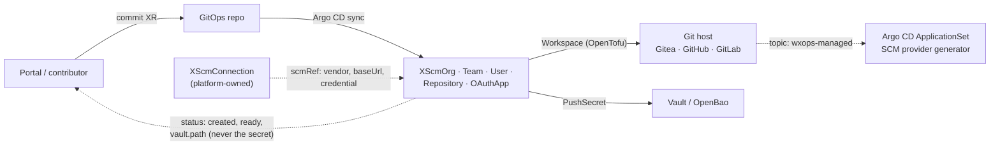

# RFC-003: SCM connections and resources — Gitea, GitHub and GitLab behind one API, with Vault-tracked credentials

## Status
<!-- Draft | In review | Accepted | Declined | Withdrawn | Implemented — and the GitHub issue that carries the discussion, e.g. "Draft · #42" -->
Implemented (Phase 1)

> [!NOTE]
> Phase 1 shipped: `scm-connection`, `scm-repository` and `scm-oauth-app`, Gitea and GitHub, `managed`/`observed` where each vendor supports it. `gitea-*` is
> archived (§Removing the old kinds), not migrated through the deprecation window this RFC originally described, since no cluster ever ran it. `XScmRepository`
> additionally repeats `vendor` from its connection — see [ADR-004](../adr/004-scm-repository-vendor-field.md) for why. Not done: GitLab,
> `XScmOrg`/`Team`/`User` (see §Org is not a kind for why org/team is deferred, not just unbuilt), the namespaced twin, and `import: true` adoption.

## Summary

Replace Core's Gitea-only Git coverage with one API family, `XScm*`, that reads and writes Gitea, GitHub and GitLab. A platform-owned **`XScmConnection`**
registers one hosting service — its vendor, base URL and where its credential lives — and every other resource points at it with **`scmRef`**, so tenants never
write a vendor, a URL or a credential. The resources are **`XScmOrg`**, **`XScmTeam`**, **`XScmUser`**, **`XScmRepository`** and **`XScmOAuthApp`**. Each works
in one of two modes: `managed` (Core creates and owns the object) or `observed` (Core only reads it, through a data source), so the same manifest can start a
new in-cluster Gitea or embed an existing hosted service. GitHub and Gitea are implemented together — the largest hosted community and a self-hosted host with
full permissions — so the model is proven against two very different hosts from the start; GitLab follows on the same model through the official
`gitlabhq/gitlab` provider. The `gitea-*` kinds are superseded and then removed, with a written migration path off them and, later, between hosts. OAuth apps
publish their client id and secret to Vault (OpenBao after migration) at a fixed path, the contract the next RFC (Dex) and OAuth2 Proxy build on.

## Goals

This RFC is judged by whether it aligns Git SCM with Kubernetes **without hardcoding** the cluster, host, org or tenant, so the same model runs across multiple
clusters and multiple tenants and can scale:

- **No hardcoded target.** A resource names a connection (`scmRef`), never a host, URL or credential; adding a cluster, a host or another
  org is adding a resource, not editing a kind.
- **Multi-tenancy by construction.** Ownership is a team label, authorization is [RFC-005](005-git-mapped-authorization.md)'s, and platform-only
  kinds are separated by API group ([ADR-002](../adr/002-three-api-groups.md)).
- **Secure by default.** Credentials live in OpenBao and are read only by the platform; repositories default `private`; nothing is deleted
  unless asked; no kind mints an administrator.
- **Knowledge that is transparent to platform engineers, developers and agents alike.** Every kind has the same `status` contract and a
  reference page, so a portal, a person and an automated agent read the same machine-checkable facts. A decision of consequence is an ADR and
  a proposal is an RFC, so the reasoning is in the repository rather than in someone's head.

## Motivation

Today Core can create a Gitea repository, org, team and user ([`gitea-*`](../../docs/api-reference/README.md)) and nothing else. Four gaps follow from that:

1. **Vendor lock.** GitHub and GitLab tenants cannot use the golden path. A repository is the first thing a scaffolded service
   needs, so the portal cannot offer "new service" to them at all. The Gitea packages are also frozen behind an archived instance
   ([`development-docs/_archives/ROADMAP.md`](../_archives/ROADMAP.md)), which leaves the repository API with no active reference vendor.
2. **Every XR carries its own credential.** Each `gitea-*` XR has a tenant-writable `credentialsSecretRef`. A field that names a Secret
   lets whoever writes the XR use any credential the provider can read, and repeats the URL and secret on every resource.
3. **OAuth clients are hand-made.** Every login integration — Dex's upstream connectors, OAuth2 Proxy in front of an app — needs an
   OAuth application registered at a Git host, and its client id and secret carried to wherever they are used. Today that is a
   click-through in a vendor UI and a secret pasted somewhere. Nothing records that the application exists, who owns it, or when its
   secret last changed, and rotating it means repeating the click-through and hoping every consumer is updated.

4. **The host is hard-wired.** Every `gitea-*` XR is bound to Gitea by its kind. Moving to, or adding, another host means rewriting every
   XR, with no declared path between the two — the lock-in this family exists to remove.

Vault already holds every other generated credential Core creates (database superuser and app creds, connection strings), mirrored by an ESO `PushSecret`. OAuth
client credentials are the same shape of problem and should follow the same pattern.

## Detailed Design

### Scope

| Kind | What it does | Can Core write it? |
|---|---|---|
| **`XScmConnection`** | Registers one hosting service and its credential. Platform-owned. | — |
| **`XScmOrg`** | An org (Gitea, GitHub) or group (GitLab): the container that owns repositories | Gitea, self-managed GitLab (CE included): yes. GitHub.com, and a top-level group on GitLab.com: observe only |
| **`XScmTeam`** | A named set of members with a permission on repositories | Gitea, GitHub: yes. GitLab: not in v1 |
| **`XScmUser`** | An account: in practice a bot or service account, since people sign in through Dex | Gitea, self-managed GitLab (CE included): yes. GitHub, GitLab.com: observe only |
| **`XScmRepository`** | A repository | All three |
| **`XScmOAuthApp`** | The host-side OAuth application, with credentials published to Vault | Gitea, self-managed GitLab (CE included): yes. GitHub, GitLab.com: observe only |

The full per-host matrix, and why it is uneven, is under *What each host lets Core write*.

Not in scope: Dex itself and its clients (RFC-004), OAuth2 Proxy deployment, cluster-access identity (Pinniped, per
[`multi-cluster-proposal.md`](../core-ideas/multi-cluster-proposal.md)), moving repository *content* between hosts (see *Migration*), and host features beyond
the neutral field sets.

### Tenancy — the org is the platform, the tenant is a team

The **org** is the platform: one organization (a GitHub org, a Gitea org) that spans the platform's clusters, observability and shared services. A **tenant is a
team inside that org.** This is the model [RFC-005](005-git-mapped-authorization.md) already assumes, and it decides what each kind means:

| Kind | Owned by | Created by |
|---|---|---|
| `XScmConnection`, `XScmOrg` | the platform (`wxops.cloud/owner: platform`) | platform operators only |
| `XScmTeam` | the tenant it names (`wxops.cloud/owner: <team slug>`) | platform onboarding; a tenant cannot create its own team, since that would let it mint a tenant identity |
| `XScmRepository` | the owning team | the team, within the org |
| `XScmOAuthApp`, `XScmUser` | `platform`, or the team for a team's own bots | per owner |

The owner label is the **team slug**, flat and legal as a label value. A repository inherits the org it lives in from its connection (`scmRef`) and is *owned
by* a team through its label; the team's access to it is expressed on `XScmTeam` (`repositories`, `permission`). On GitHub and Gitea this maps directly. On
GitLab, which has no teams, a team would map to a **subgroup under the org's group** — a proposal for the GitLab phase, not a decision here (open question 8).

### How this relates to Dex

The SCM kinds and the Dex kinds ([RFC-004](004-dex-identity-and-portal-authentication.md)) are **independent and each valid alone**: an `XScmOAuthApp` is useful
without Dex, and an `XDexConnector` can be configured from a plain Secret. They are also **referenceable**: an `XDexConnector` may point at an `XScmConnection`
(for the vendor and base URL) and an `XScmOAuthApp` (for the client id and secret in OpenBao) instead of repeating them. SCM lands first; the Dex integration
builds on it afterwards.

### The two kinds of OAuth application

This RFC covers one of two, and the split matters for what follows:

- **Upstream** — an application registered *at a Git host*, so a login system can authenticate people against that host. Dex's
  GitHub/GitLab/Gitea connectors need exactly this. **This RFC.**
- **Downstream** — a client registered *in Dex*, so an application or OAuth2 Proxy can authenticate against Dex. **RFC-004.**

Both end as a `client_id` / `client_secret` pair in Vault at the same path convention, so a consumer reads the same shape whether the issuer is a Git host or
Dex.

### API surface

Six new XRDs, `v1alpha1`, in a new **`scm.wxops.cloud`** API group — every Git-hosting kind lives there, per [ADR-002](../adr/002-three-api-groups.md).
`XScmRepository` is the one repository kind for all three hosts, **Gitea included**.

The four released `gitea-*` kinds (`XGiteaUser`, `XGiteaOrg`, `XGiteaTeam`, `XGiteaRepository`, group `platform.wxops.cloud`) cannot move group, so `XScm*`
replaces them rather than converting them, in two steps. **Superseded** from the release the `XScm*` kinds ship in: documented as replaced, unmaintained beyond
fixes. **Removed** in a later, named release through a deliberate allowlisted break (`tests/api-compat-allow.yaml`, with release notes), only after the
migration below has been run. *Migration* carries the removal checklist, because deleting an XRD deletes its XRs and, through them, their Workspaces.

```yaml
apiVersion: scm.wxops.cloud/v1alpha1
kind: XScmConnection
metadata:
  name: github-wxops
spec:
  parameters:
    vendor: github               # gitea | github | gitlab
    baseUrl: https://github.com  # required for self-hosted Gitea/GitLab, in-cluster Gitea included; defaulted for the SaaS hosts
    access: write                # write | read — a `read` connection can only serve `mode: observed`
status:
  created: true
  ready: true                    # the credential Secret is synced; the token itself is not checked
```

```yaml
apiVersion: scm.wxops.cloud/v1alpha1
kind: XScmRepository
metadata:
  name: team-alpha-api-service
  labels:
    wxops.cloud/owner: team-alpha
spec:
  parameters:
    scmRef: {name: github-wxops}  # the connection; tenants name it, never a credential. Also the sole
                                   # source of org/owner — no per-resource override, see below.
    mode: managed                 # managed | observed
    repoName: api-service
    description: Alpha squad API service
    visibility: private           # private | public; `private` is the default, unlike XGiteaRepository's public one
    defaultBranch: main
    autoInit: true
    hasIssues: true
    hasWiki: false
    topics: [wxops-managed]       # the tag GitOps discovery selects on
    retain: true                  # default: removing the XR leaves the repository; false deletes it
status:
  created: true
  ready: true
  exists: true
  cloneUrl: https://github.com/team-alpha/api-service.git
```

```yaml
apiVersion: scm.wxops.cloud/v1alpha1
kind: XScmOAuthApp
metadata:
  name: dex-gitlab
spec:
  parameters:
    scmRef: {name: gitlab-internal}
    mode: managed                 # managed | observed
    name: dex
    redirectUris: [https://dex.example.com/callback]
    confidential: true
    scopes: [openid, read_user]   # GitLab only; rejected elsewhere
    owner: platform               # picks the Vault store and path; see below
    rotation:
      generation: 1               # bump to rotate; managed mode only
status:
  created: true
  ready: true
  clientId: 7b4c…                 # not secret; the secret never appears in status
  vault:
    path: platform/oauth/dex-gitlab/credentials
```

```yaml
apiVersion: scm.wxops.cloud/v1alpha1
kind: XScmOrg
metadata:
  name: wxops
  labels: {wxops.cloud/owner: platform}
spec:
  parameters:
    scmRef: {name: gitea-internal}
    mode: managed                 # managed | observed — `observed` for an org that already exists, GitHub.com's only mode
    orgName: wxops                # immutable; the platform org
    displayName: W'xOps
    description: The platform
---
apiVersion: scm.wxops.cloud/v1alpha1
kind: XScmTeam
metadata:
  name: team-alpha-backend
  labels: {wxops.cloud/owner: team-alpha}
spec:
  parameters:
    scmRef: {name: gitea-internal}
    mode: managed
    org: wxops                    # the platform org
    teamName: backend
    permission: write             # read | write | admin — on the repositories below
    repositories: [api-service]   # names; `all` is not supported on every host, see Vendor alignment
    members: [alice, bob]         # usernames that must already exist on the host
---
apiVersion: scm.wxops.cloud/v1alpha1
kind: XScmUser
metadata:
  name: ci-bot
spec:
  parameters:
    scmRef: {name: gitea-internal}
    mode: managed
    username: ci-bot
    email: ci-bot@example.com
    owner: platform               # picks the Vault path for the generated password
    mustChangePassword: true
```

All six expose `status.created` and `status.ready` per the [status contract](../../docs/api-reference/status-contract.md). The common fields are the
intersection all three hosts support; host-only options are not part of v1. **There is no `admin` flag on `XScmUser`:** the existing `XGiteaUser` has one, and a
tenant-writable field that mints site administrators does not belong in a neutral kind. The password of a managed user is generated, never written in an XR, and
pushed to Vault.

### `XScmConnection` and `scmRef`

A connection is one hosting service the platform has been given a credential for. It is **platform-owned**: tenants do not create or edit it, which plain RBAC
can express because it is a distinct kind. In-cluster Gitea is simply a connection with `vendor: gitea` and the in-cluster service URL as `baseUrl`; Core does
not install it, which stays platform GitOps like Dex.

- **The credential** is a token stored by a platform operator in OpenBao at `platform/scm/{name}/credentials` (`remoteKey`
  `scm/{name}/credentials`, key `token`). The connection's composition emits an `ExternalSecret` that renders it into a Secret in
  `crossplane-system` named `scm-connection-{name}`, in the tfvars form the Workspaces already read: `vendor`, `base_url`, `org`,
  `access` and `token`. Core cannot mint this token — it is the bootstrap secret — so its creation and rotation are the operator's.
- **Consumers resolve it by name, through the Secret.** An `XScmRepository` or `XScmOAuthApp` composition turns `scmRef.name` into the
  Secret name with a `Format` patch (`scm-connection-%s`) and hands that Secret to its `Workspace` as `varFiles`. The URL, org and token
  reach the OpenTofu module as variables this way — the composition never reads those off the connection directly, and a tenant XR
  never contains a URL, a Secret name, or its own copy of the org.
  **`vendor` turned out to be the one exception**, found only once real testing ran against both hosts: `XScmRepository` has to pick
  between two provider-exclusive Terraform modules (one `go-gitea/gitea`-only, one `integrations/github`-only), because Terraform
  configures every provider a module declares as soon as a resource of its type exists, whether or not that resource's `count`
  evaluates to zero — there is no way to make a provider conditional from inside HCL. Crossplane has to choose which module to render
  before the connection's Secret is even read, so `vendor` is repeated on `XScmRepository.spec.parameters`, with the module's own
  `variable "vendor"` (still read from the connection, as before) validating that the two agree. `XScmOAuthApp` doesn't need this: its
  GitHub path is `observed`-only passthrough, so only one provider (`gitea`) is ever declared in its module.
- **`org` has no per-resource override, by decision.** Earlier drafts gave `XScmRepository` its own optional `org` that fell back to the
  connection's — a fallback chain duplicated in both the schema and the module. The connection's `org` is now the only source: an
  `XScmRepository` or `XScmOAuthApp` reads it straight off the connection Secret as `default_org`, with no second field to keep in sync
  or explain. `XScmConnection.org` is where the no-`/` rule lives, since it is the only place `org` is declared at all.
- **`access: read`** exists for least privilege: a read-scoped token serves observation only. A `managed` request against a read
  connection is refused by an HCL `precondition` in the module, before any write.
- **Which vendor a tenant is using is mostly not in its own XR** — `XScmRepository.spec.parameters.vendor` is the exception above, kept
  for module selection only — so most vendor-tied rules cannot be checked by the XRD schema. Rules involving only the XR's own fields
  (`rotation` with `mode: observed`) stay in the schema; rules involving the vendor (`mode: managed` on a GitHub OAuth app, a `/` in a
  GitLab owner) are HCL `validation`/`precondition` blocks in the OpenTofu module. Their failure is the Workspace's error, which the
  composition maps into the XR's status. See *Testing*.

The Portal reads connections to offer the vendor choices, so it needs read access to `XScmConnection`.

### Org is not a kind

`XScmOrg` is **not built**, in any phase, on purpose — not deferred for later, decided against. The reasoning:

- `org` is already a plain field on `XScmConnection`. Nothing in `XScmRepository`, `XScmOAuthApp` or the later `XScmTeam`/`XScmUser`
  structurally references an `XScmOrg` object, so no consumer needs one to exist.
- On GitHub it could only ever be `observed`: there is no creation API on github.com (only GitHub Enterprise Server's admin API has
  one), and GitHub's own org-wide 2FA enforcement is a second, independent reason org administration stays a human, UI-mediated action
  there.
- On Gitea, per *Tenancy*, the org **is the platform** — one long-lived object, created once, not per-tenant churn. That shape (created
  once, by a human, before anything else can reference it) is the same category as OpenBao's own bootstrap step
  ([RFC-008](008-openbao-as-a-platform-api.md)): out of band by design, not something GitOps gains by owning.
- Whether `go-gitea/gitea` even ships a writable `gitea_org` *resource* (as opposed to the `data.gitea_org` this RFC already verified) was
  never checked against the real provider schema — the kind matrix's claim predates the spike and should not be trusted until confirmed.

If a reason to observe the platform org through the API ever appears — visibility in the catalogue, something to reference by status — an `observed`-only
`XScmOrg` is a small addition. It is not planned now.

### What ships next, and what doesn't ship at all

- **`XScmUser` — rejected.** People authenticate through Dex (RFC-004); the only remaining use was bot accounts, not worth the
  credential-lifecycle risk of a kind whose job is minting host accounts.
- **`XScmTeam` — next, bundled with [RFC-004](004-dex-identity-and-portal-authentication.md) and
  [RFC-005](005-git-mapped-authorization.md).** Together they're the Git-to-cluster workflow: team membership, the
  `wxops.cloud/owner`-to-Git-team authorization mapping, and Dex login as that member — none completes it alone.
- **GitLab — deprioritized, pattern kept.** Not worth a third provider/module branch for vendors nobody's using yet; the
  one-kind/vendor-exclusive-module pattern ([ADR-004](../adr/004-scm-repository-vendor-field.md)) still applies whenever it's picked up.
- **Namespaced `Scm*` twin — unchanged**, still blocked on confirming `provider-opentofu`'s `Workspace` support; RFC-005's
  Kyverno/label approach may make it unnecessary.

### Observed mode — a data source, not a resource

`mode: observed` means Core **reads** the object and never writes or deletes it. In the Workspace it is a data source instead of a resource: `gitea_repo` (which
the Gitea provider ships alongside `gitea_org`, `gitea_team` and `gitea_user`), `github_repository` and `gitlab_project` — the last two are not verified in this
RFC's research. The outputs are the same neutral set as managed mode (`id`, `clone_url`, `ssh_url`, `html_url`), plus `status.exists`; a repository that is not
found ends `ready: false` with a clear message and is never created silently.

This lets a tenant point at a repository that already exists on an external host, or at one on a connection Core does not manage, and lets the same manifest be
used against a new in-cluster Gitea (`managed`) or an existing hosted service (`observed`) by changing one field. In observed mode the fields that only make
sense for creation — `description`, `visibility`, `defaultBranch`, `autoInit`, `hasIssues`, `hasWiki`, `topics` — are **not applied**. They are not rejected
either, and the implementation says so plainly rather than claiming otherwise: they carry XRD defaults, so no schema rule can tell "left unset" from "set to the
default". Rejecting them would mean dropping their defaults and moving them into the module, which costs more clarity than it buys.

There is deliberately no "create if missing, otherwise adopt" mode. It would silently take over an object with different settings and then begin updating it.
Taking an existing object under management is an explicit, one-shot `import: true` on a `managed` resource — **kept on the roadmap, deliberately not built
yet.** `observed` already covers every case that only needs to read; `import` is the one place a kind would gain write/delete power over something it did not
create, which is a real step up in risk over everything shipped so far and gets its own design and review before it's built, not bundled in as a Phase 1
afterthought. An OpenTofu `import` block is also static configuration, so driving one from an XR field is its own design problem regardless.

`XScmOAuthApp` uses the same word for the same idea. In `observed` mode an operator registers the application by hand, places its client id and secret in a
Kubernetes Secret, and the XR publishes that to Vault; Core does not create it and cannot rotate it.

### Composition — Terraform providers and modules, run by OpenTofu

**SCM is Terraform providers and modules; Crossplane only carries them.** Each kind's composition is a thin `function-patch-and-transform` pipeline — the same
engine the `gitea-*` packages use — that emits one `provider-opentofu` `Workspace` running the kind's OpenTofu module with the vendor's own provider
(`go-gitea/gitea`, `integrations/github`, `gitlabhq/gitlab`). There is no KCL, no vendor logic in the composition, and no direct API call anywhere (no `http`
data source, `null_resource` or `local-exec`): every action goes through a provider.

- **One generic module per kind** — but, for a kind with a real *creatable* resource on more than one vendor, "one module" means
  Crossplane choosing between vendor-exclusive module variants, not `count` on `var.vendor` inside a shared one: see
  [ADR-004](../adr/004-scm-repository-vendor-field.md) for why `count` alone doesn't stop Terraform configuring the unused provider.
  `var.mode` still gates `resource` vs. `data` within whichever variant runs. Outputs fold into one neutral set (`id`, `clone_url`,
  `ssh_url`, `html_url`, `exists`) so status reads the same on every host. Adding GitLab means a third module variant, not XRD changes.
- **Vendor rules live in HCL** as `validation` and `precondition` blocks (the *observe only* cells, a `/` in a name, unsupported
  visibility), next to the resources they guard.
- **Registry modules where a well-rated one exists, our own thin module where it does not.** A third-party module is used only if it is
  actively maintained (a release in the last twelve months), widely used, open-source licensed (Apache-2.0, MIT or MPL-2.0) and built on the
  vendor's official provider; it is pinned to an exact version, since it is fetched at `tofu init`. Gitea has no such module, so its branch
  is plain resources.
- **The HCL is inline in `composition.yaml`**, as `gitea-*` and `random-password` do, rather than a separate `.tf` file with a sync step:
  one fewer script and hook, and the module is read in the same diff as the patches that feed it. It is checked by extracting it and running
  `tofu validate`/`tofu fmt -check` against the pinned providers — done for `scm-repository` before it was committed.

The engine is OpenTofu ([RFC-002](002-migrate-terraform-to-opentofu.md)): these packages use `provider-opentofu` from the first release, so they are never
migrated. It adds no Crossplane provider beyond that one, so it adds no provider RBAC.

### Scope — cluster and namespaced

A Crossplane v2 XRD has one scope, so the tenant kinds come in two, sharing one module:

| Cluster-scoped | Namespaced | Use |
|---|---|---|
| `XScmConnection` | — | platform-owned; holds the credential, so cluster only |
| `XScmRepository` | `ScmRepository` | cluster-scoped for platform GitOps; namespaced so a team owns its repositories in its own namespace and plain RBAC does the tenancy |
| `XScmOAuthApp` | `ScmOAuthApp` | as above |

Naming follows Crossplane v2: `X` for cluster-scoped, none for namespaced. **A namespaced XR can only compose namespaced resources**, and `provider-opentofu`'s
`Workspace` has been cluster-scoped. **Phase 1 therefore ships the cluster-scoped kinds only**; the namespaced twins wait on two unanswered questions — whether
the provider serves a namespaced `Workspace`, and how one would reach the connection's Secret in `crossplane-system`.

| Vendor | Repository (`managed` / `observed`) | Org (`managed` / `observed`) | Team | User (`managed` / `observed`) | OAuth app (`managed`) |
|---|---|---|---|---|---|
| Gitea | `gitea_repository` / `data.gitea_repo` | `gitea_org` / `data.gitea_org` | `gitea_team` (+ membership) / `data.gitea_team` | `gitea_user` / `data.gitea_user` | `gitea_oauth2_app` — returns `client_id` and a sensitive `client_secret` |
| GitLab | `gitlab_project` (+ `data.gitlab_group`) / `data.gitlab_project` | `gitlab_group` / `data.gitlab_group` | none in v1 | `gitlab_user` / `data.gitlab_user` | `gitlab_application` — instance-wide, administrator token only |
| GitHub | `github_repository` (+ `github_branch_default`) / `data.github_repository` | observe only: `data.github_organization` | `github_team` (+ membership, + repository access) | observe only: `data.github_user` | **none** — observe only |

**Confirmed against the providers' own schemas** (`tofu providers schema -json`, pinned at `go-gitea/gitea ~> 0.8` and `integrations/github ~> 6.13`):
`gitea_repository`, `data.gitea_repo`, `gitea_oauth2_app` (returning `client_id` and a sensitive `client_secret`), `gitea_org`, `github_repository` (resource
and data source) and `github_branch_default` all exist with the attributes this design uses. Two findings changed the design:

- **The Gitea provider has no `topics` attribute.** `topics` is therefore GitHub-only, and a non-empty list on a Gitea connection fails the
  apply through an HCL `precondition` rather than being silently dropped. A neutral `topics` needs either a provider change upstream or a
  direct API call, which this family does not make.
- **Gitea has no `visibility` string** (it takes a `private` boolean) and **no owner field on `gitea_oauth2_app`**, which confirms an app is
  created for the token's own user. Both are absorbed inside the module.

### Kind matrix — what each provider gives us

**What Core can write is decided by the Terraform provider and the credential, not by the neutral kind.** The providers are `go-gitea/gitea`, `gitlabhq/gitlab`
(GitLab's own, published on the registry under `gitlabhq`) and `integrations/github`. A different provider, or a token with more reach, changes a cell; the
kinds do not. GitHub and Gitea are implemented first and together; GitLab follows on the same model and is expected to work end to end on self-managed
instances, **Community Edition included** — the provider's documentation attaches administrator-token requirements to the user and application resources, not an
enterprise licence (the only licence note found is for the user resource's auditor option).

| Kind | Gitea — `go-gitea/gitea` | GitLab — `gitlabhq/gitlab` | GitHub — `integrations/github` |
|---|---|---|---|
| **`XScmOrg`** | `gitea_org` · data `gitea_org` | `gitlab_group` · data `gitlab_group` | data `github_organization` only |
| **`XScmTeam`** | `gitea_team` (+ members) · data `gitea_team` | none in v1 | `github_team` (+ membership, + repository access) |
| **`XScmUser`** | `gitea_user` · data `gitea_user` | `gitlab_user` · data `gitlab_user` | data `github_user` only |
| **`XScmRepository`** | `gitea_repository` · data `gitea_repo` | `gitlab_project` · data `gitlab_project` | `github_repository` (+ `github_branch_default`) · data `github_repository` |
| **`XScmOAuthApp`** | `gitea_oauth2_app` | `gitlab_application` | none |

Data-source names other than Gitea's are this RFC's expectation from the providers' documentation and are confirmed in the spike; the Gitea provider is known to
ship data sources for org, repo, team and user.

### What each host lets Core write

The kinds are uniform; what each host's API allows is not, and that is stated here rather than hidden behind the neutral names. Where a host offers no creation
API, the kind is **observe only** on that host — still useful, because it confirms the object exists, exposes its identifiers, and lets other resources depend
on it. GitLab is split in two because the two behave differently.

| | Gitea | GitHub.com | GitLab self-managed (CE or EE) | GitLab.com |
|---|---|---|---|---|
| **Org / group** | write | observe — GitHub.com's REST API does not create organizations (only Enterprise Server's admin API does) | write | **top-level: observe** — the provider's own documentation says a top-level group cannot be created with the resource on GitLab.com and must be created in the UI and imported. **Subgroups: write** (`parent_id`) |
| **Team** | write | write | none — GitLab has groups and membership access levels, not teams | none |
| **User** | write (admin token) | observe — there is no API to create a user | write (administrator token) | observe — no instance administrator |
| **Repository** | write | write | write | write |
| **OAuth app** | write | observe — no creation API | write (administrator token, instance-wide) | observe — instance-wide, needs an administrator |

Cells that say *observe* are exactly the places where `mode: managed` is rejected by the composition with an explicit message. GitLab's `gitlab_group` and
`gitlab_application` limits above are from the provider's own documentation; the GitHub cells and the rest of the GitLab column rest on documentation and
search, and every cell is confirmed against its provider in the spike.

### Vendor alignment

**GitLab uses the same strategy as Gitea and GitHub** — one Workspace, one credential Secret, one repository resource, and outputs mapped to the same neutral
names (`id`, `clone_url`, `ssh_url`, `html_url`). It differs in a short, specific list of places. This section names each one and the decision that keeps it
from spreading into the API. The rule behind every decision: **`XScmRepository` contains only fields that mean the same on all three hosts; a host difference is
absorbed inside that host's HCL branch, or the field is left out.** A field that would need a host-specific meaning is not added until two hosts support it or a
tenant asks.

| Concern | Gitea | GitHub | GitLab | Decision |
|---|---|---|---|---|
| **Owner** | `username` on the resource, an org or user | not on the resource: set as `owner` on the *provider* | a numeric `namespace_id`, resolved from a group's `full_path`; groups nest to 20 levels | `owner` is one **flat** string: an org, or a **top-level** GitLab group. GitLab needs one extra data source to resolve it; the neutral field is unchanged |
| **Nested groups** | none | none (orgs are flat) | subgroups, addressed as `parent/child` | **Not in v1.** A `/` is rejected. This also keeps `wxops.cloud/owner` ([RFC-005](005-git-mapped-authorization.md)) a legal label value, which cannot contain `/`. **This sits badly with GitLab.com**, where the usual shape is one top-level group with a subgroup per team; see open question 8 |
| **Visibility** | `private` boolean | `visibility` (public, private, internal on Enterprise) | `visibility_level`: private, internal, public | `visibility: private \| public`, **default `private`**. `internal` exists on GitLab and GitHub Enterprise but not Gitea, so it is left out until asked for |
| **Default branch** | an attribute on the repository | the attribute is deprecated; a separate `github_branch_default` resource, which needs the branch to exist first | an attribute on the project, plus `initialize_with_readme` to create it | `defaultBranch` stays neutral. GitHub's branch resource and its ordering live in the GitHub branch of the composition |
| **Feature toggles** | issues, wiki, projects, pull requests | issues, wiki, projects (no pull-request toggle) | issues, merge requests, wiki (differently named) | Only **`hasIssues` and `hasWiki`** are neutral. `hasProjects` and `hasPullRequests` do not mean the same thing everywhere, so they are not in the new kind |
| **Credential** | token | token (or an app credential) | token, and a base URL for self-managed | held by the `XScmConnection`; the composition builds each provider block from it |
| **Deletion** | destroys the repository | destroys the repository | can hold a deleted project for a retention period and reserve its path | `retain: true` by default on all three, so an XR deletion never deletes source code |
| **Team permission** | a team-wide permission, optionally over all repositories | no team-wide permission: access is granted per repository | no teams | `permission` plus an explicit `repositories` list. `all` is Gitea-only and rejected elsewhere, since enumerating every GitHub repository into a team is brittle |
| **Team on GitLab** | — | — | groups and subgroups with per-user access levels | `XScmTeam` is **not supported on GitLab in v1**. Mapping a team to a subgroup would need the nested-owner design v1 declines; revisited with open question 8 |
| **User credentials** | initial password, `admin` flag | cannot be created | initial password, admin flag | password generated and pushed to Vault, `mustChangePassword` true, **no `admin` flag** in the neutral kind |

Two of these are things to confirm rather than assume, and both are spike items: the GitLab Terraform provider has an open report of project settings such as
the README and default branch not being applied on create
([terraform-provider-gitlab#6309](https://gitlab.com/gitlab-org/terraform-provider-gitlab/-/work_items/6309)), and whether each provider exposes topics — the
discovery mechanism below depends on them.

**OAuth applications are where GitLab genuinely differs, and it is a capability difference, not a naming one.** GitLab's Applications API manages
**instance-wide** applications and requires an **administrator**; it cannot manage group or user applications. So a GitLab connection can create and rotate an
application only on a **self-managed** instance with an administrator token — a much more powerful credential than a repository token, so it belongs on its own
connection under the platform-only rule. On GitLab.com there is no instance administrator, so it is no different from GitHub, whose OAuth Apps have no creation
API at all. (Gitea's `gitea_oauth2_app` is, as far as this RFC found, created for the token's own user; that ownership needs confirming.) Rather than a rule per
vendor, this is expressed once, as `mode`:

- **`managed`** — Core creates the host-side application, publishes its credentials, and can rotate them. Available for Gitea and
  self-managed GitLab.
- **`observed`** — described above. Available everywhere, and the only mode for GitHub and GitLab.com.

What both modes provide is the single tracked location in Vault, which is what Dex and OAuth2 Proxy consume.

### Credentials in Vault

Output flow is the one `platform-database-clusters` already uses: the Workspace writes a connection Secret, an ESO `PushSecret` mirrors the whole Secret to
Vault as a single write, `deletionPolicy: Delete` so removing the XR removes the entry. Paths follow the [Vault path
convention](../../CLAUDE.md#vault-path-convention) — `remoteKey` omits the KV mount prefix:

| `owner` | Store | `remoteKey` | Full logical path |
|---|---|---|---|
| `platform` | platform store, scoped to `platform/` | `oauth/{name}/credentials` | `platform/oauth/{name}/credentials` |
| a tenant | tenant store, scoped to `tenants/` | `{owner}/oauth/{name}/credentials` | `tenants/{owner}/oauth/{name}/credentials` |

A managed `XScmUser`'s generated password follows the same flow, at `{owner}/scm-users/{username}/credentials` (or `scm-users/...` under `platform`).

The OAuth entry carries `client_id`, `client_secret`, `vendor`, `base_url`, `redirect_uris` and `generation`. **OpenBao:** it keeps the Vault API and KV v2, so
the `ClusterSecretStore` changes its server URL and nothing in the composition or the path convention changes. External Secrets Operator documents OpenBao as
supported through its Vault provider (tested upstream with ESO v0.16.1 and OpenBao v2.2.0); running it against this repo's own stores is still a spike.

### Rotation

Rotation applies to `managed` OAuth apps and is explicit and Git-driven: bumping `spec.parameters.rotation.generation` makes the composition replace the
host-side application (new client id and secret), the `PushSecret` writes a new KV v2 version, and the previous versions stay in Vault as the history that
answers "when did this last change, and to what". The bump is a normal commit, so it appears in the audit trail like any other change.

Known limits, stated up front:

- **Replacement is not zero-downtime.** For `gitea_oauth2_app` and `gitlab_application` the old secret stops working when the
  application is replaced. Consumers (an ESO `ExternalSecret` feeding Dex, say) pick up the new value on their refresh interval and,
  unless something restarts them, need a rollout. Overlapping secrets would need host support that these two do not offer.
- **The OpenTofu state is a second copy.** `provider-opentofu` keeps state as a Secret in the cluster, and that state contains the
  client secret. Vault is the tracked, rotatable copy; the state Secret is the one to keep under RBAC review.
- **Scheduled rotation** (rotate every *N* days without a commit) could be done with a `time_rotating` trigger in the HCL. It depends
  on how often `provider-opentofu` re-plans, so it is a spike, not part of the first cut.
- **The connection's own token** is the operator's to rotate; this RFC does not automate it.

### Migration — off `gitea-*`, and between hosts

A declared, portable shape is what removes the lock-in; moving the *content* of a host is a separate job. Two migrations are covered.

**From `XGiteaOrg` / `Team` / `User` / `Repository` to `XScm*`, on the same Gitea.** Nothing is destroyed at any step, and each step before the handover is
reversible:

1. Add an `XScmConnection` for the Gitea.
2. Declare each existing object as an `XScm*` resource in **`observed`** mode. It reads the object the old kind manages and changes
   nothing, which proves the new kinds see the same identities.
3. Hand over management. On the old kind's composed Workspace set `deletionPolicy: Orphan`, exactly as
   [RFC-002](002-migrate-terraform-to-opentofu.md) does for its engine swap, then switch the `XScm*` resource to `managed` with a one-time
   **`import: true`**, so its first apply *adopts* the existing object instead of failing with "already exists". Once it has reconciled,
   remove the flag.
4. Delete the old XR. Because its Workspace was orphaned, the Gitea object is left alone.

**Removing the old kinds.** Only after every old XR has been deleted, in that order, in the release that drops them — unless, as happened here, there is no
cluster running them to protect in the first place (checked: this project had no live deployment of `gitea-*` when `XScm*` shipped), in which case the whole
sequence collapses to steps 2–4 done at once:

1. No `XGitea*` XR remains, and each one's Workspace was orphaned **before** it was deleted. Deleting an XRD with XRs still present
   deletes them, which deletes their Workspaces, which runs a destroy against Gitea. (Moot with no live cluster, but the rule stands
   for any adopter who does have one.)
2. The release notes list the removed kinds and the release that superseded them.
3. `tests/api-compat-allow.yaml` gets one entry per kind, each with its reason, and `make release` then requires the notes.
4. The `gitea-*` packages, examples, test cases and `docs/api-reference/` pages move out of the active tree, **archived rather than
   deleted** — package source to `package/platform/archives/<name>/`, everything else to the sibling `_archives/` folder in
   `tests/cases/`, `examples/` and `docs/api-reference/` (skipped by test discovery, not rendered or built). The reasoning, the HCL
   and the test fixtures stay in the repo for reference; only `VERSIONS.yaml` and the install manifests say the kind no longer
   exists.

`import` is explicit and one-shot by design. There is still no silent "create if missing, otherwise adopt": adoption always happens because a person set
`import: true` on one resource.

**Between hosts, for example Gitea to GitHub.** Core moves the declared shape; the content moves out of band:

1. Add an `XScmConnection` for the target host.
2. Declare the org, teams and repositories on the target as new `XScm*` resources (`managed` where the host allows, `observed` where
   the object already exists — a GitHub org, say).
3. Move repository content with the host's own tools (a mirror push preserves history); issues, pull requests and CI are host-specific
   and outside Core.
4. Switch consumers — Argo CD ApplicationSets, Dex connectors — to the target.
5. Retire the source resources with `retain: true`, so nothing on the old host is deleted.

**`scmRef` is immutable** (enforced by the schema). Repointing an existing managed resource at another host would make its Workspace plan a destroy of the
object on the old host; a migration is always a *new* resource beside the old one, never an edit.

### GitOps streaming

"Streaming" here means the one path every Core resource already takes, extended to connections, repositories and OAuth apps:



Secrets never travel through Git: a commit carries only the XR, the portal reads `status.vault.path` and the host-side result, and the credential itself moves
Workspace → Secret → Vault. Created repositories carry a topic so an Argo CD ApplicationSet with an SCM provider generator (which supports GitHub, GitLab and
Gitea) can discover them across hosts without a per-repository Application. This design works under every model in [open decision
3](../_archives/ROADMAP.md#open-decisions) (portal → Git, portal → API, hybrid) and does not pre-empt it.

### Compatibility and change tier

Five new packages, one per kind: `scm-connection`, `scm-team`, `scm-user`, `scm-repository` and `scm-oauth-app`. Each has `current: unreleased` in
`VERSIONS.yaml`. Adding a package is `safe` under `tests/api_compat.py`; no released XRD changes. All would be labelled `channel: stable` per
[ADR-001](../adr/001-package-channel-label.md).

### Testing

Per the [testing rules](../../CLAUDE.md#testing), each conditional branch needs a case. Most vendor behaviour reaches the module only through the connection
Secret, with no branch in the composition at all — offline goldens prove the `Workspace` each kind renders (module text, variables, `varFiles` Secret name) for
each scope, and vendor behaviour is proven where it lives, in OpenTofu. `scm-repository` is the exception: its `vendor` field *is* a composition-level branch (a
`match` transform choosing the whole module string), so its goldens also prove that the right module — and only the right module's provider — gets selected.

- a golden case per vendor for each kind, in both `managed` and `observed` where applicable, plus owner `platform` vs a tenant for the
  Vault path
- an `observed.yaml` case for the ready/unready derivation, generated with `mkobserved.py`
- schema-level negative cases under `_invalid/`: `rotation` or any create-only field with `mode: observed`, unknown `mode`, a `/` in
  `owner`, `visibility: internal`
- **vendor rules in HCL**: `mode: managed` on a GitHub OAuth app, `managed` against an `access: read` connection, `scopes` on a non-GitLab
  app — proven by `tofu validate` on the module offline where possible, and by `plan` in the cluster tier
- an invariant that a kind's cluster and namespaced compositions embed the **same** module text, so the scopes cannot drift; and that no
  scm module contains an `http` data source, `null_resource` or `local-exec`
- observe-only cells in the host matrix: `managed` `XScmOrg` on GitHub.com or GitLab.com, `managed` `XScmUser` on GitHub, and any
  `XScmTeam` on GitLab must each fail with the module's documented precondition message
- `import: true` on a `managed` resource renders an import block; on an `observed` resource it is rejected; `scmRef` is immutable
- an `XScmUser` never renders an `admin` attribute, and its password reaches Vault, never an XR field or status
- an invariant that the `PushSecret` `remoteKey` never starts with the KV mount prefix, and that no composition emits RBAC
- **a field-matrix invariant**: every neutral field either renders on all three hosts or is explicitly rejected for those that cannot
  honour it, so no field is ever silently ignored on one host. This is what keeps GitLab from drifting away from the others

This proves the rendered output only. Whether the host API accepts the HCL, and whether the OpenBao store behaves like Vault, need a cluster and a live host —
the kind-based e2e tier in the roadmap. An in-cluster Gitea (MIT-licensed, one container) is the natural first target, and doubles as RFC-002's acceptance
environment.

## Drawbacks

- **This is a large RFC.** Six kinds across three hosts, with a migration path. The phasing makes each piece shippable alone, but if
  review load is a problem it splits cleanly at the connection-plus-OAuth-app pieces (which unblock RFC-004) and the rest.
- **The matrix is uneven and stays uneven.** Org and user are observe-only on the SaaS hosts, and teams do not exist on GitLab. The
  neutral names promise a shape, not that every host can be *written* — the price of not pretending otherwise.
- **A neutral API is a lowest common denominator.** Anything host-specific (GitHub branch protection, GitLab subgroups and `internal`
  visibility, project and pull-request toggles) is left out of v1. That is deliberate, and the price is that a tenant who needs one has
  to ask for a field.
- **`scmRef` moves vendor rules out of the schema.** A tenant learns that `managed` is unsupported on GitHub from the module's precondition
  error after applying, not from a rejected manifest. The price of keeping URLs and credentials out of tenant hands.
- **A connection is a shared dependency.** Deleting one that is in use breaks every resource that references it; Crossplane's `Usage`
  resource could guard that, and is not designed here.
- **GitHub and GitLab.com are second-class for OAuth apps** — observe only, no rotation — because of the hosts' APIs, not ours.
- **Managed GitLab OAuth needs an instance-administrator token.** It can create applications for the whole instance, which makes it
  the single most powerful credential in this RFC.
- **Three Terraform providers to keep pinned and tested**, where today there is one. Each has its own release cadence and
  authentication model.
- **Inline HCL grows per vendor** inside one composition, and the offline suite cannot validate any of it against the host.
- **Client secrets live in OpenTofu state** as well as Vault (see Rotation).
- **The archived Gitea instance** means the Gitea branch has no live environment to be checked against until an in-cluster Gitea is
  running.

## Alternatives

- **`credentialsSecretRef` on every XR**, as the `gitea-*` kinds do. Simplest and needs no connection kind, but each tenant XR can name
  any Secret the provider can read, and repeats the vendor, URL and credential.
- **Per-vendor kinds** (`XGitHubRepository`, `XGitLabProject`, …), matching the `gitea-*` precedent. Simpler to build and no
  lowest-common-denominator problem, but the portal and Dex need one shape and would branch per vendor themselves; that is the cost
  this RFC moves into the platform.
- **One polymorphic kind for every Git resource** (repositories, orgs, teams, users behind a `type:` field). It needs conditional
  schemas and a status that differs by type; one kind per noun, each with its own OpenTofu module, stays clearer.
- **Native Crossplane providers instead of Workspaces** — community providers exist for GitHub and GitLab. They would avoid the
  Workspace layer and its state Secret, but bring their own maturity and RBAC surface, and the repo has so far chosen a Workspace-based
  provider for vendor APIs for consistency. Worth re-checking the maturity of each before implementation.
- **Vault as the generator.** Have Vault mint or hold the client credentials. Neither host issues an OAuth application from a Vault
  secrets engine that this RFC found, so Vault stays the tracked store, not the source.
- **Do nothing.** Keep registering OAuth applications by hand. The cost is the one in *Motivation*: no record, no owner, no rotation,
  and RFC-004 has nothing to build on.

## Rollout Plan

Each phase is useful alone and can ship as its own release. The work starts with **GitHub and Gitea together** (Phases 1–2); GitLab follows. The kind matrix is
confirmed against each provider in the same spike.

- [ ] **Phase 1 — the backbone, on GitHub and Gitea together.** `scm-connection`; `scm-repository` (`managed` and `observed`);
  `scm-oauth-app` — `managed` on Gitea, `observed` on GitHub. That is enough for the Dex GitHub and Gitea connectors to reference an
  SCM connection and an app. Two providers from the first phase means the field-matrix invariant and the module's vendor preconditions
  are built here, not later. Acceptance: a throwaway **GitHub org** (free) and an **external Gitea** the
  maintainer or adopter operates; Core only needs its URL and a token.
- [ ] **Phase 2 — team, user.** `scm-team`, `scm-user`: Gitea `managed`; GitHub `managed` for teams, `observed` for user. `import: true`,
  and the same-host migration off `gitea-*` run end to end to prove it destroys nothing. **No `scm-org`** — see *Org is not a kind*.
- [ ] **Phase 3 — GitLab.** `gitlabhq/gitlab` on a **self-managed CE** instance first, with an administrator token on its own connection:
  repository, org, user and `managed` OAuth app; then GitLab.com with its top-level group `observed`. Teams as subgroups if open
  question 8 says so.
- [x] **Phase 4 — archive `gitea-*` — done, ahead of schedule.** The planned order was: run the same-host migration, wait out a
  deprecation window for other adopters, then remove. None of that applied — this project had no live deployment of `gitea-*` to
  protect, so there was nothing to migrate and no window to wait out. Archived (not deleted) in the same release that shipped
  `XScmConnection`/`XScmRepository`/`XScmOAuthApp`, per *Migration*. An adopter who **does** have a live cluster still needs the full
  orphan-first procedure before following suit. The discovery topic and an ApplicationSet SCM-generator example ship with Phase 1 or 2.
- [ ] **Phase 5 — rotation.** `rotation.generation`, the KV v2 history, and the spike on scheduled rotation.
- [ ] **OpenBao spike** — run Phase 1 against an OpenBao-backed `ClusterSecretStore`. Runs alongside, not after, so the store
  migration never blocks a phase.
- [ ] **A host-to-host migration rehearsal** — Gitea to GitHub on a scratch pair, following *Migration*, before it is described as
  supported.

On acceptance, the decisions this settles are recorded as ADRs — the connection-and-`scmRef` indirection, the `XScm*` family and neutral kinds over per-vendor
kinds, `managed | observed` as the one mode vocabulary with `import` as the explicit adoption step, and the Vault credential path.

## Open Questions

1. **GitHub Apps.** GitHub Apps are the vendor's preferred integration model and can be created through a manifest flow, but that flow
   needs a person to confirm in a browser. Is observe-only for OAuth Apps enough, or should this RFC cover Apps too?
2. **"GitOps streaming".** This RFC reads it as the Git → Argo → Crossplane → host path plus ApplicationSet discovery. If the intent
   also includes something else — webhooks back to Argo, or streaming host events into status — that is additional scope.
3. **Which tenants may use which connection.** A tenant can name any connection. Is that limited by the token's own reach, by an
   `allowedOwners` list on the connection, or by [RFC-005](005-git-mapped-authorization.md)'s policies?
4. **Namespaced kinds.** Does `provider-opentofu` serve a namespaced `Workspace`, and how does a namespaced Workspace read the connection
   Secret from `crossplane-system` — a copy per allowed namespace, or its own `ExternalSecret` from OpenBao? This decides when
   `ScmRepository` and `ScmOAuthApp` ship.
5. **Consumer reload.** After a rotation, consumers such as Dex need a restart. [RFC-004](004-dex-identity-and-portal-authentication.md)
   proposes Reloader for exactly this; does this RFC's rotation just rely on that, or does it need its own statement?
6. **GitLab.com OAuth applications.** GitLab also documents a separate *User Applications* API. Does it cover a case the instance-wide
   Applications API cannot, so that GitLab.com could be `managed` rather than observe-only?
7. **Topics per vendor.** Does each of the three Terraform providers expose repository topics, and does Argo CD's SCM provider generator
   filter on them for all three? Discovery is only as uniform as its weakest host.
8. **GitLab teams as subgroups.** With the org as the platform and a tenant as a team, GitLab (no teams) would map a team to a subgroup
   under the org's top-level group, through an optional `rootNamespace` on the `XScmConnection`, with the team slug flat so the owner label
   stays legal. That is writable on GitLab.com (subgroups can be created there) and matches the provider. Is that the right mapping, and
   does it hold for the GitLab CE instances you run, where nested groups are common?
9. **`internal` visibility.** Worth adding once GitLab or GitHub Enterprise tenants ask, with the schema rejecting it on Gitea?
10. **`import` safety.** `import: true` adopts an existing object and then manages it, including changing its settings to match the XR.
    Should the first apply after an import be plan-only, needing a second explicit step to write?
11. **Users that do not exist yet.** A GitHub team can list a member who has not joined the org; the host sends an invitation and the
    membership stays pending. Does `ready` wait for acceptance, or report the pending state?
12. **Org per environment — settled.** One org per platform is enough. The org holds the platform's many resources; **`XScmConnection` is how
    other orgs, teams or tenants attach**: another org, or another host, is another connection, and nothing in the kinds assumes there is only one.
    What remains open is question 3 (which tenants may use which connection).
