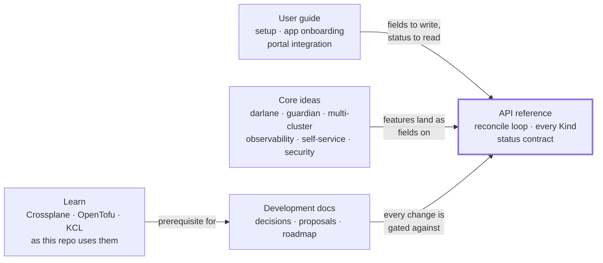

# W'xOps Core Documentation

W'xOps Core publishes platform APIs as Crossplane v2 composite resources: Git hosting, identities, PostgreSQL clusters and databases,
and tenant applications with Darlane workspaces. You declare one resource, and Crossplane keeps everything behind it reconciled.

This folder is for **anyone who uses, operates, builds on or learns from the platform**: the API, how to install and run it, how to
onboard an application, and where the platform is heading. The decisions, proposals, roadmap and development process live in
[`development-docs/`](../development-docs/README.md).

**Table of Contents**
- [Find your way](#find-your-way)
- [The sections](#the-sections)
  - [Learn](#learn)
  - [API reference](#api-reference)
  - [Core ideas](#core-ideas)
  - [User guide](#user-guide)
- [How the sections connect](#how-the-sections-connect)
- [Development docs](#development-docs)

---

## Find your way

| I want to… | Start here |
|---|---|
| Learn Crossplane, OpenTofu or KCL well enough to read this repo | [Learn](learn/README.md) |
| Install W'xOps Core on a cluster | [Setup](user-guide/setup.md) |
| Ship an application end to end | [App onboarding](user-guide/app-onboarding.md) |
| Know what a resource does, which fields it takes, and what the reconcile loop does for me | [API reference](api-reference/README.md) |
| Build a portal or a tool against the API | [Portal integration](user-guide/portal-integration.md) · [Status contract](api-reference/status-contract.md) |
| Understand where the platform is heading | [Core ideas](#core-ideas) · [Solution matrix](core-ideas/solution-matrix.md) |
| Change the platform, cut a release, or record a decision | [Development docs](../development-docs/README.md) |

---

## The sections

### Learn

Contributor onboarding for someone who hasn't used Crossplane, OpenTofu or KCL before — four short
pages, each teaching one concept against a real file in this repo rather than a generic tutorial.
Read only the pages you're missing.

| Doc | What it covers |
|---|---|
| [**Start here**](learn/README.md) | Which of the four pages to read, mapped to the package you're about to touch |
| [Crossplane in five minutes](learn/01-crossplane-in-5-minutes.md) | XRD, XR, Composition, composed resource — walked through `scm-connection` end to end |
| [OpenTofu and HCL, the way this repo uses them](learn/02-opentofu-here.md) | The inline-HCL `Workspace` pattern `scm-repository` and `scm-oauth-app` use |
| [KCL, the way this repo uses it](learn/03-kcl-here.md) | This repo's KCL idioms (`_get`, ternary chains, conditional composition) on a real slice of code |
| [Your first change](learn/04-your-first-change.md) | A guided edit to `scm-oauth-app`, start to finish: schema, template, test, PR |

### API reference

What each Kind accepts, what Core composes and keeps reconciled for it, and what it reports back.
The schema source is `package/<group>/<name>/xrd.yaml`; the API group (`platform`, `scm`, ...) is per package — see
[ADR-002](../development-docs/adr/002-three-api-groups.md).

| Doc | Kind | What it covers |
|---|---|---|
| [**Start here** — the reconcile loop and every Kind](api-reference/README.md) | all | What you can do with an XR (create, change, pause, hold, delete), how to read status, and a catalogue of every Kind |
| [gitea-user](api-reference/_archives/gitea-user.md) (archived) | `XGiteaUser` | A Gitea user and its generated password — superseded by `scm-repository` |
| [gitea-org](api-reference/_archives/gitea-org.md) (archived) | `XGiteaOrg` | A Gitea organisation with visibility and metadata — superseded by `scm-repository` |
| [gitea-team](api-reference/_archives/gitea-team.md) (archived) | `XGiteaTeam` | A team inside an organisation, including membership — superseded by `scm-repository` |
| [gitea-repository](api-reference/_archives/gitea-repository.md) (archived) | `XGiteaRepository` | A repository owned by an organisation — superseded by `scm-repository` |
| [platform-database-clusters](api-reference/platform-database-clusters.md) | `XPlatformDatabaseCluster` | A CloudNativePG cluster with poolers, backups and Vault-seeded credentials |
| [tenant-database](api-reference/tenant-database.md) | `XTenantDatabase` | A tenant database on a shared or dedicated cluster, credentials pushed to Vault |
| [tenant-app](api-reference/tenant-app.md) | `XTenantApp` | Deployment, Service, ingress with TLS and SSO, monitoring, and the Darlane twin |
| [random-password](api-reference/_archives/random-password.md) (archived) | `XRandomPassword` | Utility composition, not published as a package |
| [scm-connection](api-reference/scm-connection.md) | `XScmConnection` | One Git hosting service and its credential, rendered for every other `scm` resource |
| [scm-repository](api-reference/scm-repository.md) | `XScmRepository` | A repository on Gitea or GitHub, created (`managed`) or read (`observed`) |
| [scm-oauth-app](api-reference/scm-oauth-app.md) | `XScmOAuthApp` | A host-side OAuth application, with its credentials in the secret store |
| [status-contract](api-reference/status-contract.md) | all | Every package's `status` fields on one page: the absent-vs-`false` split, `ready` vs `dependenciesReady` |

### Core ideas

The ideas and features the platform is built around, from shipped to researched. Each doc opens
with a status banner that says how settled it is.

| Doc | Maturity | What it covers |
|---|---|---|
| [solution-matrix](core-ideas/solution-matrix.md) | Index | **The idea map.** 44 problems across observability, multi-cluster and AI self-service: the chosen tool, what current packages already solve, and the industry practice to study |
| [darlane](core-ideas/darlane.md) | Shipped in `XTenantApp`; `XDarlane` designed | The in-cluster developer twin: file sync, traffic mirroring, A/B and header routing, SRE-agent workflows |
| [guardian](core-ideas/guardian.md) | Vision | Platform-injected scanning, audit and AI code-review sidecars for Darlane sessions |
| [multi-cluster](core-ideas/multi-cluster.md) | Design | Hub-and-spoke architecture: control, identity and data planes, two reference architectures, and the migration path from one cluster |
| [multi-cluster-proposal](core-ideas/multi-cluster-proposal.md) | Proposal | The chosen path: CAPI + ArgoCD hub-spoke + structured authn, k8gb + ExternalDNS, and a prototype with exit criteria |
| [multi-cluster-connectivity](core-ideas/multi-cluster-connectivity.md) | Options analysis | Securing the hub→spoke API connection, across three independent trust paths, for new and existing clusters |
| [multi-cluster-scale](core-ideas/multi-cluster-scale.md) | Research | Regions, tenancy tiers, heterogeneous hardware (arm64 edge, GPU), and the XRD gaps each exposes |
| [observability](core-ideas/observability.md) | Part 1 shipped, Part 2 options | Metrics emission from `XTenantApp`, then collection at single-cluster, fleet and multi-cluster scale |
| [self-service-operations](core-ideas/self-service-operations.md) | Research + direction | The operability ladder, status as a diagnosis graph, runbooks, and the agent→PR loop behind the test gate |
| [knowledge-architecture](core-ideas/knowledge-architecture.md) | Research + direction | ADRs, runbooks, knowledge graph and Agent Skills under the SRE agent, with golden incidents as evals |
| [security-threat-model](core-ideas/security-threat-model.md) | Consolidation | Assets, trust boundaries, threats mapped to mitigations, and the honest gap list |

### User guide

Running W'xOps Core and building on it.

| Doc | What it covers |
|---|---|
| [setup](user-guide/setup.md) | Prerequisites and platform dependencies, providers, credentials, installing packages, and a first resource |
| [app-onboarding](user-guide/app-onboarding.md) | The golden path from picking a template to a running `XTenantApp`, through `XGiteaRepository` |
| [portal-integration](user-guide/portal-integration.md) | The consumer side of the API: screen-by-screen field map, health cards, error-to-runbook wiring, and what a portal must never do |

---

## How the sections connect

The API reference sits in the middle on purpose. A core idea becomes real when it lands as a field on a Kind. A user guide is a path
through those fields. Learn is prerequisite reading for development, not a section of it — it teaches the underlying tools, not this
repo's workflow. Every development change is checked against the released API.

---

## Development docs

Decisions, proposals, the roadmap and the development process are in [`development-docs/`](../development-docs/README.md):

| Doc | What it covers |
|---|---|
| [**Development docs hub**](../development-docs/README.md) | Find your way, the development matrix, and where new docs go |
| [Development guide](../development-docs/development/README.md) | The change loop, hooks and make targets, and the rules that bite |
| [Releasing](../development-docs/development/releasing.md) | Version axes, why a released XRD only grows, `make release`, CI publishing |
| [ROADMAP](../development-docs/_archives/ROADMAP.md) (archived) | Phases, the deferred core, decisions made and rejected, open decisions, as of the release it describes — superseded by the [RFC index](../development-docs/rfc/README.md) |
| [ADR](../development-docs/adr/README.md) | One committed file per decision of lasting consequence |
| [RFC](../development-docs/rfc/README.md) | One committed file per proposal, argued before it is built |
| [`CONTRIBUTING.md`](../CONTRIBUTING.md) | Setup, the change loop, commit messages, and the checklist for a new package |
| [`CLAUDE.md`](../CLAUDE.md) | Architecture, KCL conventions, the working model, and the reference stack |
